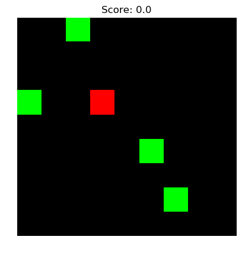
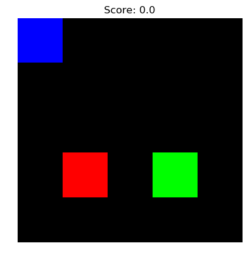

# DQSnake
Train an agent to play Snake using the deep reinforcement learning algorithm from [[1]](#paper1).

To improve stability and accelerate learning the following extensions to the original DQN algorithm are used:
* Double Q-learning (adapted from [[2]](#paper2))
* Dueling Network Architecture (adapted from [[3]](#paper3))
* Prioritized Experience Replay (adapted from [[4]](#paper4))

## Usage
To train an agent to play Snake, run:

> python3 train.py snake_config.json

The training script takes as input a configuration file that specifies the neural network architecture and hyperparameters of the DQN algorithm. A  suitable configuration for the game Snake is provided in the file [snake_config.json](snake_config.json).

The performance of the agent is evaluated regularly and if the average reward per game has improved, the current neural network model is saved. To load a saved neural network and resume training, run:

> python3 train.py saved_model --load_model

`saved_model` must be a folder containing a saved neural network model

Tensorboard can be used monitor to monitor the loss, gradients, q-values and average reward per game.

> tensorboard --logdir tensorboard

## Advanced Usage

The program can also be used with a simpler game called Box, in which the agent has to push a box onto a goal position.

> python3 train.py box_config.json

To output a fixed number of game frames using a saved neural network model, run:

> python3 train.py saved_model --load_model --eval 100 --img_path images

## Results

The following animation shows an agent playing Snake on a 9x9 board. The head of the snake is colored in red, the body as blue and goals as green. The agent has been trained for 11 million steps (about 7 hours on a NVIDIA GTX 1060).

An agent playing Box. The agent is colored in red, the box in blue and the goal in green. The agent has been trained for 2 million steps.

## References
<a name="paper1">[1]</a>: Mnih,  V.,  Kavukcuoglu,  K.,  Silver,  D.,  Rusu,  A. A.,  Veness, J., Bellemare, M. G., Graves, A., Riedmiller, M.,
Fidjeland, A. K., Ostrovski, G., Petersen, S., Beattie, C.,
Sadik, A., Antonoglou, I., King, H., Kumaran, D., Wierstra, D., Legg, S., and Hassabis, D., [Human-level control through deep reinforcement learning](https://web.stanford.edu/class/psych209/Readings/MnihEtAlHassibis15NatureControlDeepRL.pdf), Nature, 518 (7540), pages 529–533, 2015

<a name="paper2">[2]</a>: Hado van Hasselt, Arthur Guez, David Silver, [Deep Reinforcement learning with Double Q-learning](https://arxiv.org/abs/1509.06461), in Proceedings of the Thirtieth AAAI Conference on Artificial Intelligence, 2016

<a name="paper3">[3]</a>: Ziyu Wang, Tom Schaul, Matteo Hessel, Hado van Hasselt, Marc Lanctot, Nando de Freitas, [Dueling Network Architectures for Deep Reinforcement Learning](https://arxiv.org/abs/1511.06581), Proceedings of the 33rd International Conference on Machine Learning, Volume 48, 2016

<a name="paper4">[4]</a>: Tom Schaul, John Quan, Ioannis Antonoglou, David Silver, [Prioritized Experience Replay](https://arxiv.org/abs/1511.05952), International Conference on Learning Representations (ICLR), 2016

## License

[MIT](LICENSE)
